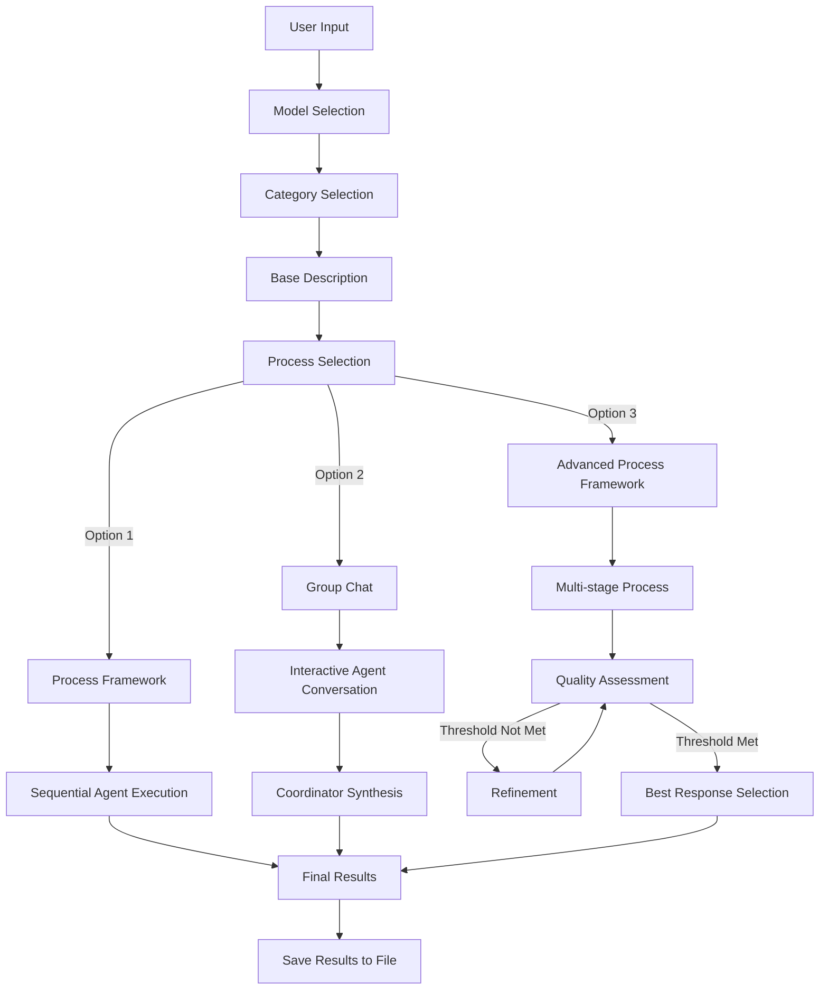
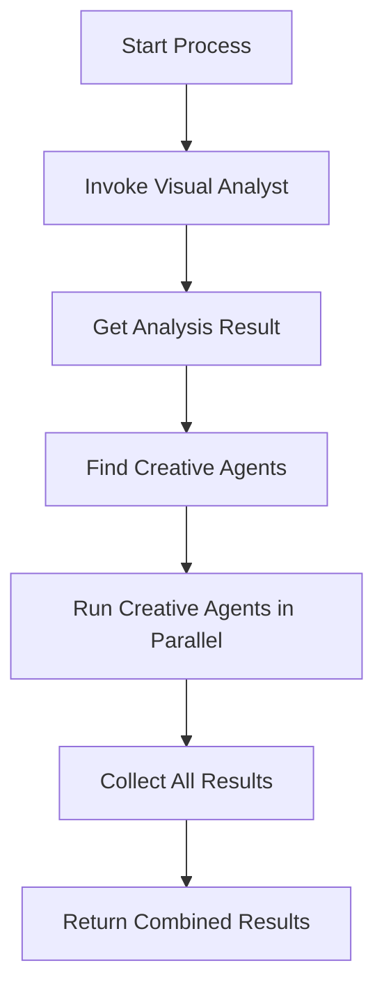
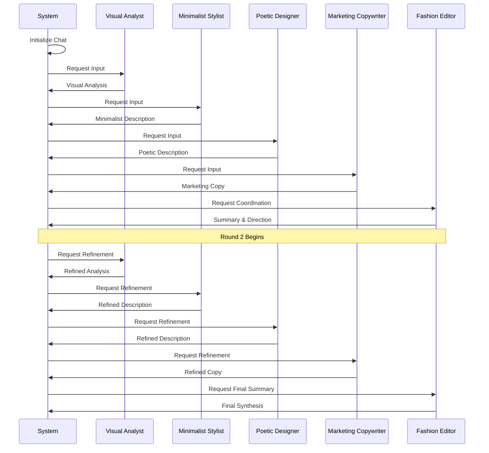
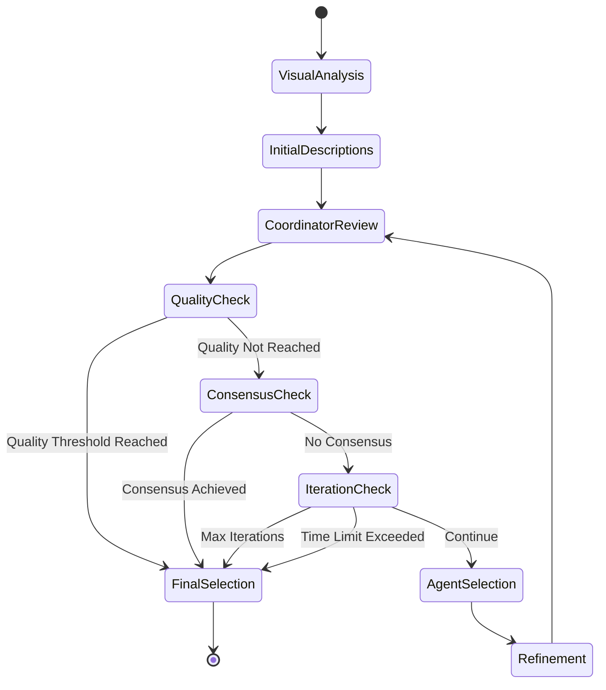

marp: true

# Multi-Agent Clothing Analysis System with Semantic Kernel

## Building Advanced AI Agents with Azure Semantic Kernel Process Framework

May 2025

---

## Project Overview

- **What**: A C# application using multiple LLM-powered agents to analyze clothing items
- **Why**: Demonstrate Semantic Kernel's capabilities for multi-agent orchestration
- **How**: Three different approaches to multi-agent orchestration:
  - Process Framework (Sequential)
  - Group Chat (Interactive) 
  - Advanced Process Framework (Multi-stage)

---

## Key Technologies

- **Azure Semantic Kernel**: Core orchestration framework
- **Azure OpenAI Service**: GPT-4.1, GPT-4o, GPT-3.5-turbo
- **Process Framework**: Sequential and advanced process patterns
- **Group Chat**: Conversational agent interaction pattern
- **C# / .NET 9.0**: Implementation language

---

## System Architecture



---

## Agent Personas

| Agent | Role | Style |
|-------|------|-------|
| **Minimalist Stylist** | Clean, concise descriptions | Modern, minimal |
| **Poetic Designer** | Metaphor-rich language | Creative, expressive |
| **Marketing Copywriter** | Persuasive content | Benefit-driven |
| **Visual Analyst** | Detail-oriented analysis | Technical, precise |
| **Fashion Editor** | Conversation coordinator | Synthesizing |

---

## Approach 1: Process Framework (Sequential)

- Basic sequential process with parallel creative agents
- Visual Analyst first, then creative agents in parallel
- Simple, deterministic execution flow

```csharp
// Step 1: Start with the Visual Analyst to establish a baseline
var visualAnalystConfig = _agents.Find(a => a.Name == "Visual Analyst");
var analysisResult = await InvokeAgentAsync(visualAnalystConfig);
results.Add(analysisResult);

// Step 2: Run the creative agents in parallel
var creativeAgents = _agents.FindAll(a => a.Name != "Visual Analyst");
var creativeResults = await Task.WhenAll(
    creativeAgents.Select(agent => InvokeAgentAsync(agent))
);
results.AddRange(creativeResults);
```

---

## Process Framework: Flow



---

## Approach 2: Group Chat (Interactive)

- Simulates a conversation between agents
- Agents take turns responding
- Coordinator provides guidance between rounds
- Agents build on each other's insights

```csharp
// Run the conversation for multiple rounds
for (int round = 0; round < maxRounds; round++) {
    // Each agent takes a turn in the conversation
    foreach (var agent in _agents) {
        var agentMessage = await agent.GenerateResponseAsync(_history);
        _history.Add(agentMessage);
    }
    
    // Coordinator summarizes and provides direction
    var coordinatorResult = await _kernel.InvokePromptAsync(coordinatorPrompt);
    _history.Add(new ChatMessage(_coordinator.Name, coordinatorResult.GetValue<string>()));
}
```

---

## Group Chat: Flow



---

## Approach 3: Advanced Process Framework (Multi-stage)

- Sophisticated multi-stage process
- Dynamic agent selection for refinement
- Multiple termination conditions 
- Quality assessment and consensus checking

```csharp
// Iterative Refinement Process
while (!terminationConditions.ShouldTerminate()) {
    // Coordinator Review stage
    await ExecuteStage("Coordinator Review", "Review the descriptions...", 
                      new[] { "Process Coordinator" });
    
    // Check quality threshold and consensus
    bool qualityThresholdReached = await EvaluateQuality();
    bool consensusAchieved = await CheckConsensus();
    
    if (qualityThresholdReached || consensusAchieved) break;
    
    // Refinement Stage with dynamically selected agents
    var agentsToRefine = await SelectAgentsForRefinement();
    await ExecuteStage("Refinement", "Refine your description...", agentsToRefine);
}
```

---

## Advanced Process Framework: Flow



---

## Termination Conditions

Four ways to end the advanced process:

1. **Quality Threshold Reached**: Output meets quality criteria
2. **Consensus Achieved**: Agents converge on similar themes
3. **Maximum Iterations**: Prevents excessive computation
4. **Time Limit Exceeded**: Ensures timely response

```csharp
public class TerminationConditions {
    public bool QualityThresholdReached { get; set; } = false;
    public bool MaxIterationsReached { get; set; } = false;
    public bool ConsensusAchieved { get; set; } = false;
    public bool TimeLimitExceeded { get; set; } = false;
    
    public bool ShouldTerminate() {
        return QualityThresholdReached || MaxIterationsReached || 
               ConsensusAchieved || TimeLimitExceeded;
    }
}
```

---

## Quality Evaluation

LLM-based quality assessment against multiple criteria:

```csharp
private async Task<bool> EvaluateQuality() {
    // Get all descriptive responses
    var descriptiveResponses = _chatHistory
        .Where(m => m.Sender != "system" && m.Sender != "Process Coordinator")
        .ToList();
            
    // Construct the prompt for evaluating quality
    string prompt = $@"
    Evaluate the quality of these descriptions based on:
    1. Accuracy - Does the description match the product?
    2. Creativity - Is the language engaging?
    3. Marketing Value - Would this help sell the product?
    4. Uniqueness - Do descriptions offer different perspectives?
    5. Completeness - Do descriptions cover all aspects?

    Have we reached a high quality threshold?
    Answer YES or NO.
    ";
    
    var result = await _kernel.InvokePromptAsync(prompt);
    return result.GetValue<string>().Contains("YES", StringComparison.OrdinalIgnoreCase);
}
```

---

## File Persistence

Results saved to timestamped files for analysis and comparison:

```
========== CLOTHING ANALYSIS RESULTS ==========
Category: TShirt
Process Type: AdvancedProcessFramework
Date: 2025-05-19 14:30:45
==========================================

[Minimalist Stylist]
A clean-cut crew neck t-shirt in soft cotton blend...

------------------------------------------

[Poetic Designer]
Draped in casual elegance, this t-shirt embodies...

------------------------------------------

[SELECTED FINAL DESCRIPTION]
The perfect blend of comfort and style, this classic t-shirt...
```

---

## Sample Results Comparison

| Agent | Description Sample |
|-------|-------------------|
| **Visual Analyst** | *"Classic crew neck t-shirt in vibrant blue. Short sleeves, regular fit, cotton material with minimal design elements..."* |
| **Minimalist Stylist** | *"Essential blue t-shirt. Clean lines, soft cotton, versatile style. Modern simplicity for everyday wear."* |
| **Poetic Designer** | *"A canvas of azure tranquility, this t-shirt whispers comfort against the skin like a gentle summer breeze..."* |
| **Marketing Copywriter** | *"Elevate your everyday style with our Premium Cotton Tee. Designed for ultimate comfort and durability..."* |

---

## Performance Comparison

|                        | Speed | Quality | Interaction | Complexity |
|------------------------|-------|---------|-------------|------------|
| **Process Framework**  | ★★★★★ | ★★★☆☆   | ★☆☆☆☆       | ★☆☆☆☆      |
| **Group Chat**         | ★★★☆☆ | ★★★★☆   | ★★★★★       | ★★★☆☆      |
| **Advanced Framework** | ★★☆☆☆ | ★★★★★   | ★★★☆☆       | ★★★★★      |

---

## Implementation Benefits

- **Multi-perspective insights**: Different agents provide unique viewpoints
- **Quality control**: Automatic assessment of output quality
- **Flexible orchestration**: Choose the right approach for different needs
- **Process transparency**: Clear visibility into the decision-making process
- **Results persistence**: Save and compare different analyses

---

## Future Enhancements

- Actual image analysis using Azure Computer Vision API
- Custom plugins to extend agent capabilities
- Web-based UI for easier interaction
- Parallel processing for multiple items
- Support for additional LLM providers
- A/B testing of different agent prompts and configurations

---

## Demo

[This slide would contain screenshots or a live demo]

---

## Questions?

GitHub Repository: [github.com/yourusername/semantic-kernel-clothing-analysis](https://github.com/yourusername/semantic-kernel-clothing-analysis)

Documentation: [Semantic Kernel Docs](https://learn.microsoft.com/en-us/semantic-kernel/overview/)

---

## Thank You!

Contact: your.email@example.com
