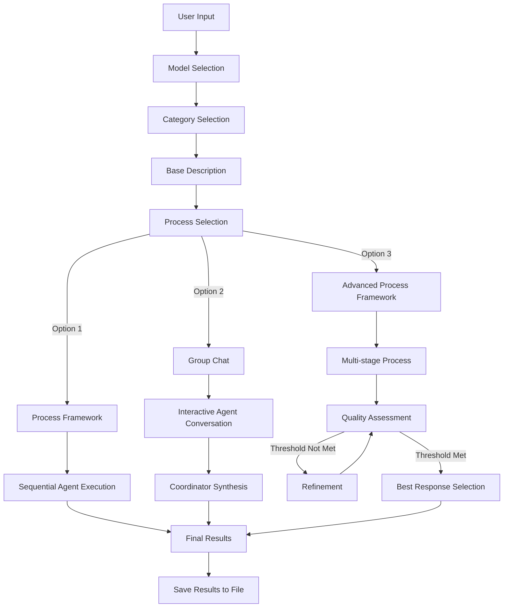

# Semantic Kernel Clothing Analysis System

A C# application that uses Azure Semantic Kernel to analyze clothing items using multiple LLM-powered agents with different personas. The system implements three different approaches to multi-agent orchestration using the Semantic Kernel Process Framework.


## Overview

This application demonstrates how to build an advanced multi-agent system using Azure Semantic Kernel's Process Framework. The system analyzes clothing items (T-shirts, Sweaters, Jeans) and generates creative descriptions from different perspectives using specialized AI agents that take on distinct personas.

Key features:
- Three different implementation approaches for multi-agent orchestration
- Support for multiple LLM models (GPT-4.1, GPT-4o, GPT-3.5-turbo)
- Advanced termination conditions and quality assessment
- Color-coded console output for better readability
- Result persistence with timestamped files

## Architecture

The application implements a clothing analysis system with four specialized agent personas:

1. **Minimalist Stylist**: Creates clean, modern, concise product descriptions
2. **Poetic Designer**: Develops metaphor-rich, creative language descriptions
3. **Marketing Copywriter**: Writes persuasive, benefit-driven product descriptions
4. **Visual Analyst**: Provides detailed analysis of visual elements including style, color, and pattern

These agents work together through three different orchestration approaches:



## Implementation Approaches

The system offers three different approaches to implement multi-agent orchestration, each with its own strengths:

### 1. Process Framework (Sequential)

This approach implements a basic sequential process where agents execute one after another.

**Key characteristics:**
- Starts with Visual Analyst to establish a baseline understanding
- Runs creative agents (Minimalist, Poetic, Marketing) in parallel
- Simple, deterministic execution flow
- Results are combined at the end

**Implementation details:**
- The `ClothingAnalysisProcess` class handles the orchestration
- `AgentConfiguration` objects define the prompts and styling
- `RunProcessAsync` method executes the process sequence
- `InvokeAgentAsync` handles individual agent execution

**When to use:**
- When you need a straightforward, predictable result
- For simple workflows where agent interaction isn't required
- When performance and speed are priorities

### 2. Group Chat (Interactive)

This approach simulates a conversation between agents, allowing them to build on each other's insights.

**Key characteristics:**
- Agents interact in conversation rounds
- A coordinator (Fashion Editor) provides guidance between rounds
- Agents can reference and build upon previous agents' contributions
- More dynamic and interactive process

**Implementation details:**
- The `GroupChat` class manages the conversation flow
- `Agent` objects represent individual participants
- `RunAsync` method handles the turn-taking and history
- `ChatMessage` objects store the conversation history

**When to use:**
- When you want agents to build on each other's ideas
- For more creative, conversational results
- When the interaction between agents is valuable

### 3. Advanced Process Framework (Multi-stage)

This approach implements a sophisticated multi-stage process with dynamic agent selection, quality assessment, and termination conditions.

**Key characteristics:**
- Multiple defined stages (Analysis, Initial Descriptions, Review, Refinement, Selection)
- Dynamic selection of agents for refinement based on coordinator feedback
- Multiple termination conditions (quality threshold, iterations, consensus, time)
- Best response selection at the end

**Implementation details:**
- The `AdvancedProcessFramework` class manages the complex workflow
- `TerminationConditions` control when the process ends
- Quality and consensus evaluation methods assess progress
- `SelectAgentsForRefinement` dynamically chooses which agents continue
- `SelectBestResponse` determines the final output

**When to use:**
- For complex, critical workflows that require high quality
- When you need more control over the process
- For scenarios where refinement is essential
- When you need to optimize for quality vs. computation time

## Implementation Guide

### Prerequisites

- .NET 9.0 SDK or higher
- An Azure OpenAI API key (set as environment variable `AZURE_OPENAI_API_KEY`)
- Azure OpenAI deployments for the models you want to use (gpt-4.1, gpt-4o, etc.)

### Step 1: Clone the Repository

```bash
git clone https://github.com/yourusername/semantic-kernel-clothing-analysis.git
cd semantic-kernel-clothing-analysis
```

### Step 2: Set up Environment Variables

```bash
# For macOS/Linux
export AZURE_OPENAI_API_KEY="your-api-key-here"

# For Windows PowerShell
$env:AZURE_OPENAI_API_KEY="your-api-key-here"
```

### Step 3: Update Azure OpenAI Endpoint

In `Program.cs`, update the endpoint URL to your Azure OpenAI endpoint:

```csharp
builder.AddAzureOpenAIChatCompletion(
    deploymentName: selectedModel,
    endpoint: "https://your-endpoint.openai.azure.com/",
    apiKey: Environment.GetEnvironmentVariable("AZURE_OPENAI_API_KEY")
);
```

### Step 4: Create Required Folders

Ensure the clothing analysis folders exist:

```bash
mkdir -p clothes/TShirt clothes/Sweater clothes/Jeans results
```

Add sample images to each folder (e.g., `tshirt.jpg`, `sweater.jpg`, `jeans.jpg`).

### Step 5: Build and Run the Application

```bash
dotnet build
dotnet run
```

### Step 6: Follow the Interactive Prompts

1. Select an AI model (GPT-4.1, GPT-4o, or GPT-3.5-turbo)
2. Choose a clothing category to analyze (TShirt, Sweater, Jeans)
3. Enter a base description for the clothing item
4. Select the processing approach:
   - Process Framework (Sequential)
   - Group Chat (Interactive)
   - Advanced Process Framework (Multi-stage)
5. View the generated descriptions from each agent
6. Results will be saved to the `results` folder

## Project Structure

```
semantic-kernel-clothing-analysis/
├── temp/                            # Project root
│   ├── Program.cs                   # Main application
│   ├── ClothingAnalysisProcess.cs   # Process Framework implementation
│   ├── GroupChat.cs                 # Group Chat implementation
│   ├── AdvancedProcessFramework.cs  # Advanced Process Framework
│   └── temp.csproj                  # Project file
├── clothes/                         # Sample clothing images
│   ├── TShirt/
│   ├── Sweater/
│   └── Jeans/
└── results/                         # Saved analysis results
```

## Advanced Configuration Options

### Customizing Agent Personas

To customize the agent personas, modify the agent configurations in each implementation:

```csharp
// Example from ClothingAnalysisProcess.cs
_agents = new List<AgentConfiguration>
{
    new AgentConfiguration(
        "Your Custom Agent Name", 
        "Your custom agent prompt", 
        ConsoleColor.Your_Color),
    // Add more agents...
};
```

### Adding Termination Conditions

To customize termination conditions in the Advanced Process Framework, modify the `TerminationConditions` class and the conditions in `RunAdvancedProcessAsync` method:

```csharp
// Example: Modifying time limit
var timeLimit = TimeSpan.FromMinutes(10); // Change from 5 to 10 minutes

// Example: Modifying max iterations
int maxIterations = 3; // Change from 2 to 3 iterations
```

### Customizing Quality Assessment

To adjust the quality assessment criteria, modify the `EvaluateQuality` method in `AdvancedProcessFramework.cs`:

```csharp
// Example: Adding more evaluation criteria
string prompt = $@"
You are a quality assurance specialist evaluating product descriptions for a {_category}.
Base description: {_baseDescription}

{string.Join("\n\n", descriptiveResponses.Select(r => $"[{r.Sender}]: {r.Content}"))}

Evaluate the quality of these descriptions according to the following criteria:
1. Accuracy - Does the description match the product details?
2. Creativity - Is the language engaging and distinctive?
3. Marketing Value - Would this description help sell the product?
4. Uniqueness - Do the descriptions offer different perspectives?
5. Completeness - Do the descriptions cover all important aspects?
6. YOUR_NEW_CRITERION - Your new evaluation criterion

For each criterion, rate the set of descriptions from 1-10. Then provide an overall assessment.
Have we reached a high quality threshold (where further iterations would yield minimal improvements)?
Answer YES or NO.
";
```

## Performance Considerations

- The Advanced Process Framework is the most computationally intensive but produces the highest quality results
- For quick results, use the Process Framework
- For interactive, creative results, use the Group Chat
- The time to complete will vary based on the model selected, with GPT-3.5-turbo being fastest but potentially lower quality

## Error Handling

The application includes error handling for common scenarios:
- Missing environment variables
- Invalid user input
- API connectivity issues
- File system operation failures

All errors are logged to the console with descriptive messages.

## Further Development

Potential enhancements to consider:
- Implement actual image analysis using Azure Computer Vision API
- Add custom plugins to extend agent capabilities
- Create a web-based UI for easier interaction
- Implement parallel processing for multiple items
- Add support for additional LLM providers

## License

This project is licensed under the MIT License - see the LICENSE file for details.
